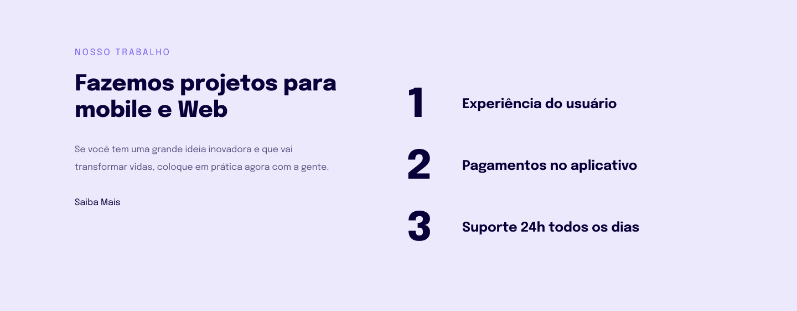
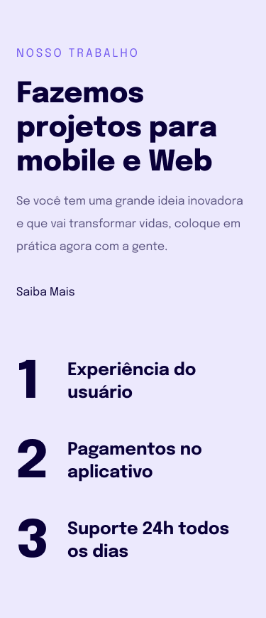

<h1 align="center">Introdução à Responsividade</h1>

Este é um projeto para dar introdução à responsividade, exclusivo e promovido pela Rocketseat para ensino de tecnologias WEB.  

  <a href="#-tecnologias">Tecnologias</a>&nbsp;&nbsp;&nbsp;|&nbsp;&nbsp;&nbsp;
  <a href="#-projeto">Projeto</a>&nbsp;&nbsp;&nbsp;|&nbsp;&nbsp;&nbsp;
  <a href="#-layout">Layout</a>&nbsp;&nbsp;&nbsp;|&nbsp;&nbsp;&nbsp;
  <a href="#memo-licença">Licença</a>

  

 

  
  

## 🚀 Tecnologias

Esse projeto foi desenvolvido com as seguintes tecnologias:

- HTML e CSS
- Git e Github
- Figma

## 💻 Projeto

O objetivo desse projeto é criar toda a estrutura do projeto de uma forma responsiva:

<strong>1º /</strong> Fiz a estrutura HTML para dispotivos móveis.  
<strong>2º /</strong> Estilizei todo o projeto no CSS.  
<strong>3º /</strong> Ajustei as configurações de responsividade para tamanhos de telas acima de 700px.
 
 
Projeto Concluído✅

- [Visite o Projeto Online](http://SaymonRezendeX.github.io/aprendendo-responsividade)

## 🔖 Layout

Você pode visualizar o layout do projeto através [DESSE LINK](https://www.figma.com/file/zF9uXqA72fbbcN9g9fyHV9/Explorer-Stage-03-Projeto-02-(Copy)?node-id=203%3A412&mode=dev). É necessário ter conta no [Figma](https://figma.com) para acessá-lo.

## :memo: Licença

Esse projeto está sob a licença MIT.

---

Feito com ♥ by Rocketseat :wave: [Participe da nossa comunidade!](https://discord.gg/rocketseat)